# MailMaestro - ChatGPT for Outlook

Top 5 outlook extensions

self report: https://learn.microsoft.com/en-us/microsoft-365-app-certification/outlook/mailmaestro-chatgpt-for-outlook?pivots=data

https://appsource.microsoft.com/en-us/product/office/WA200005168?tab=Overview

# Screens

## Default

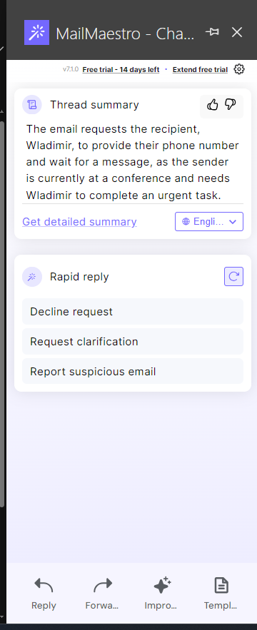

## Reply to Email

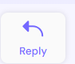
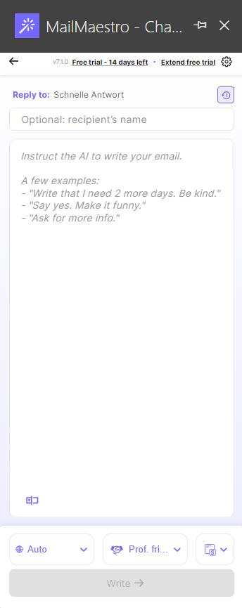
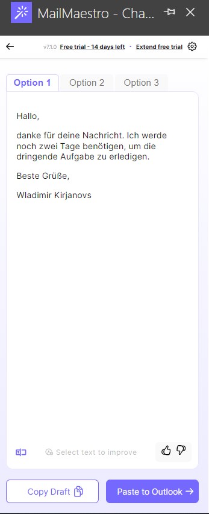

### Paste to Outlook

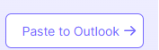

### Improve Selected Text

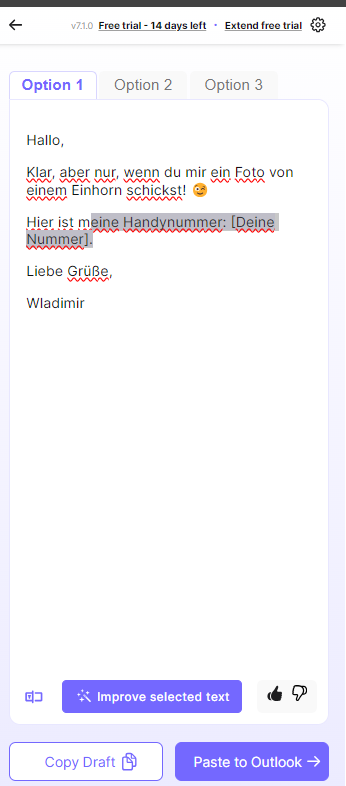
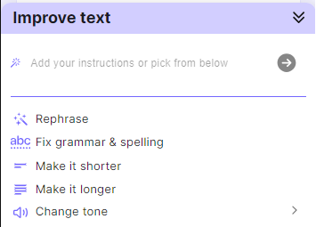
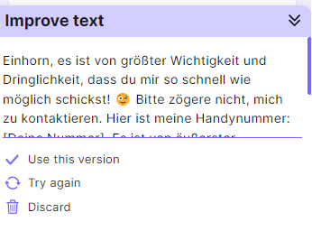

### Text Shortcuts

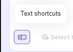
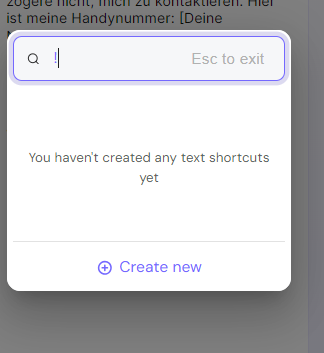
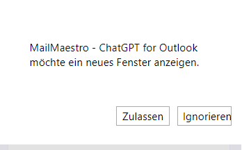
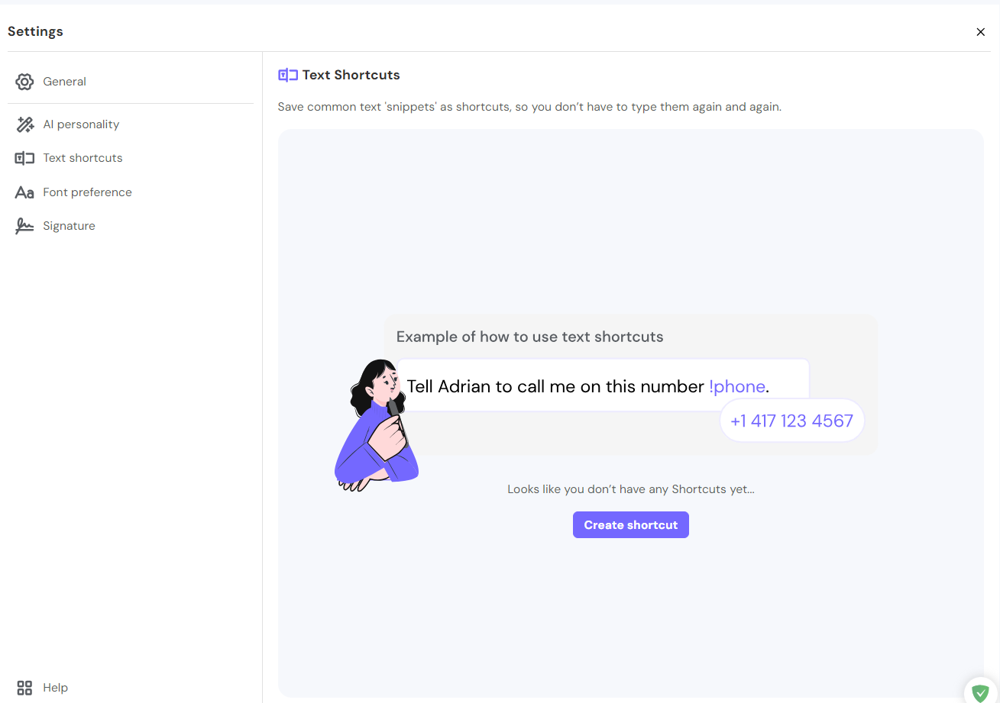

## Forward Email

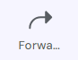
Same Screens as Reply

## Language / Tone / Paragraph Chooser

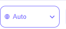
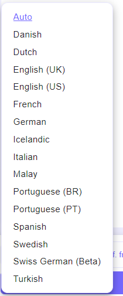
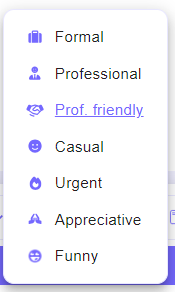
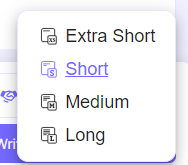

## Improve draft

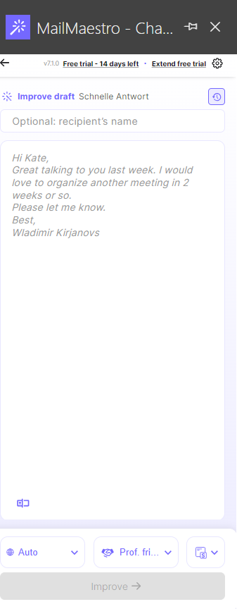
Same as reply

## Magic Template

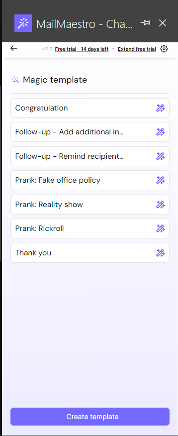

## Thread Summary

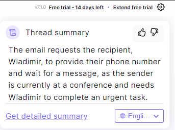
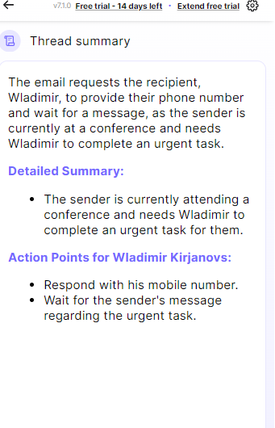

## Settings

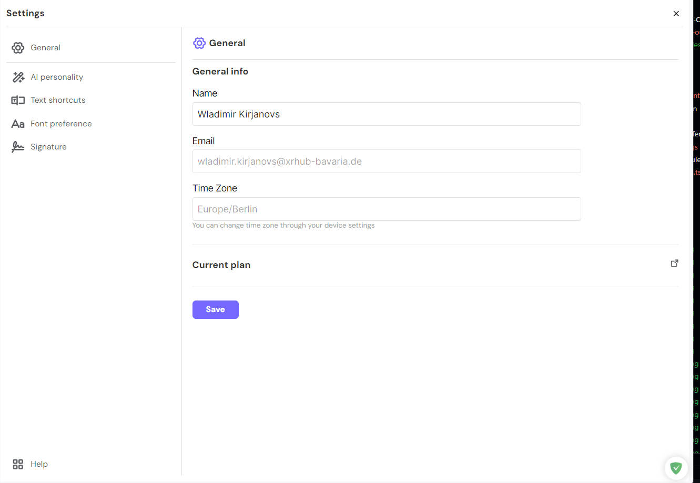
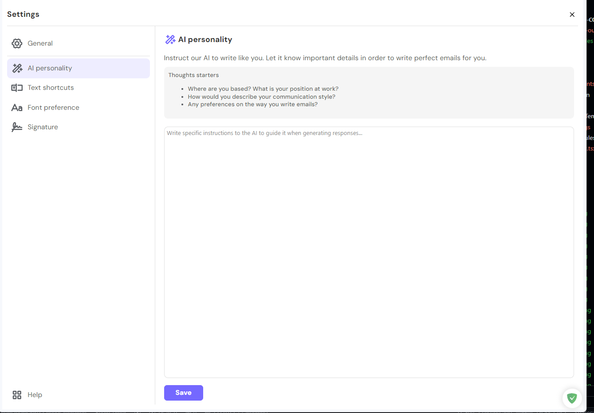

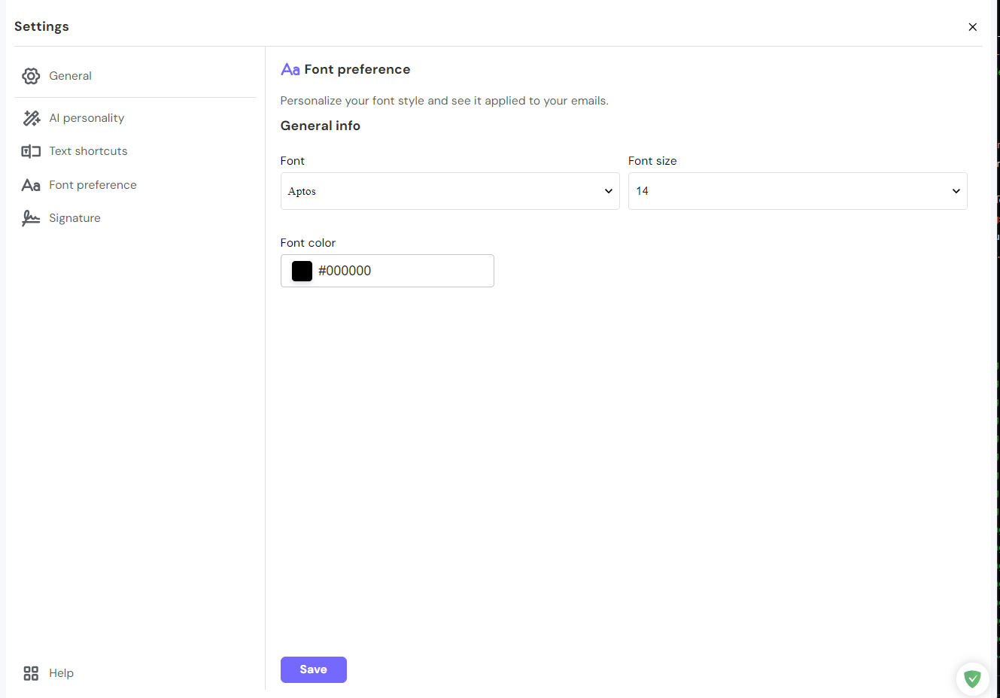
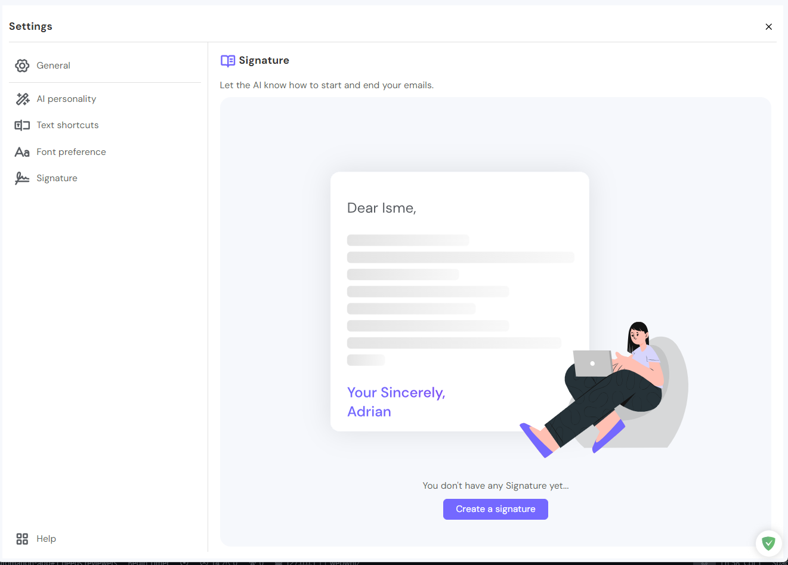
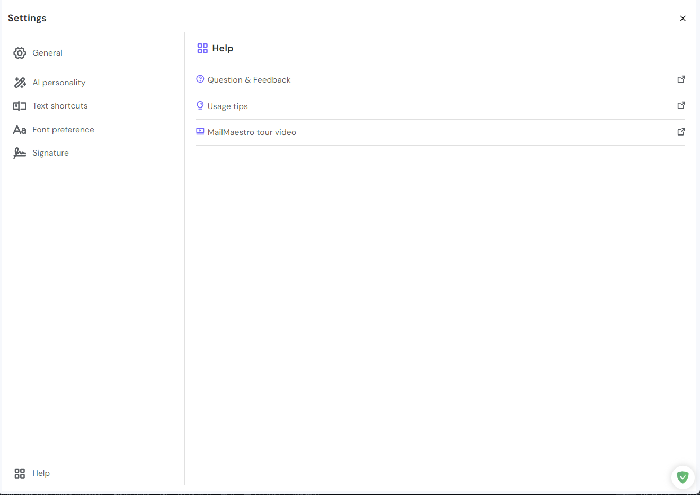

## Pricing Plan

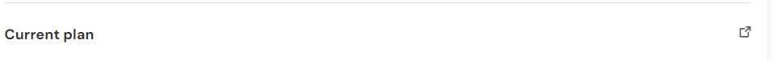
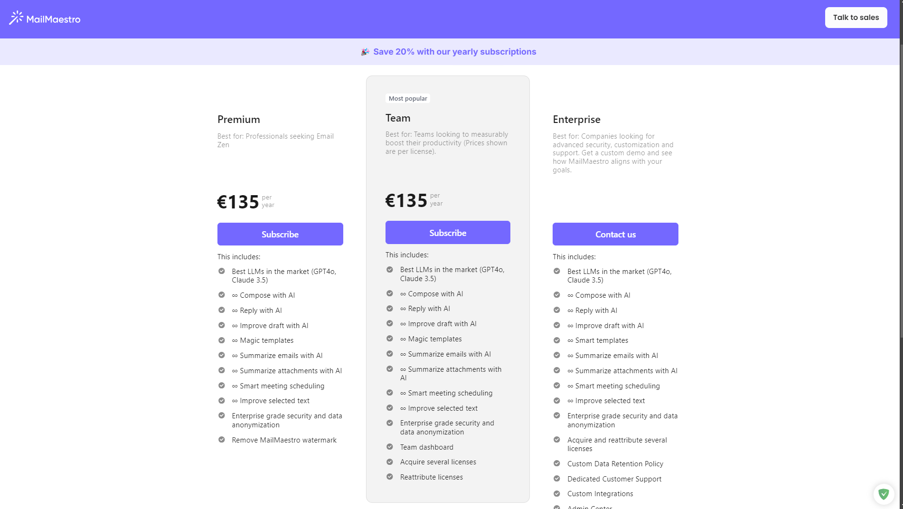

## Attachments

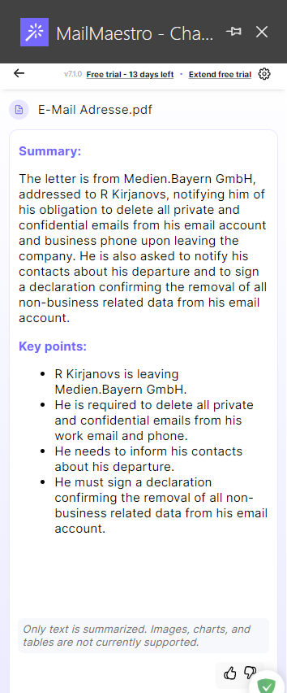
