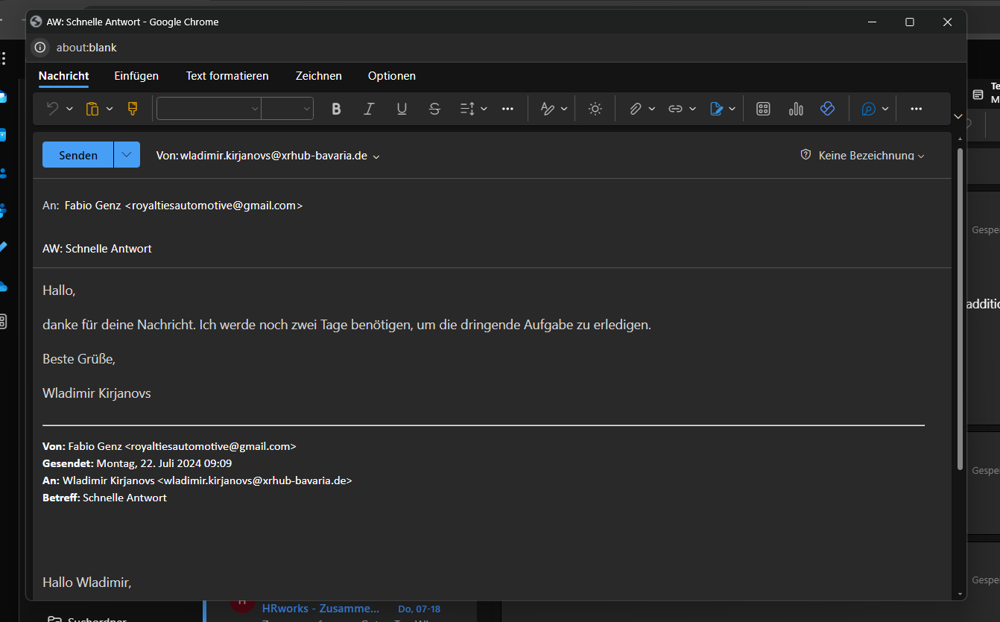
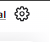
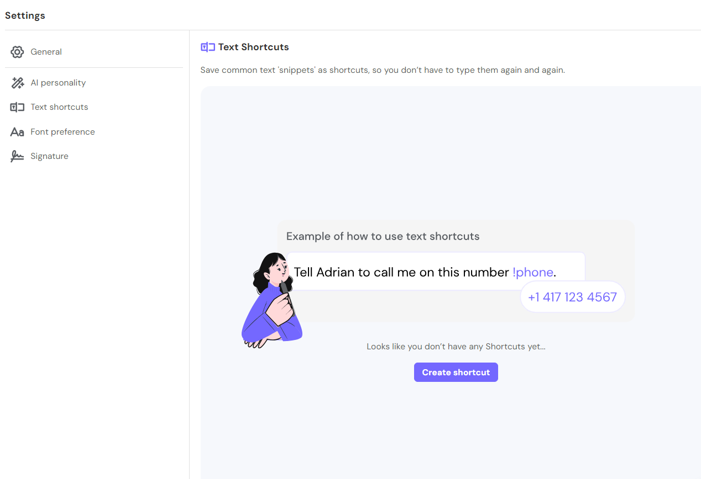
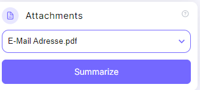

# MailMaestro - ChatGPT for Outlook

Top 5 outlook extensions

self report: https://learn.microsoft.com/en-us/microsoft-365-app-certification/outlook/mailmaestro-chatgpt-for-outlook?pivots=data

https://appsource.microsoft.com/en-us/product/office/WA200005168?tab=Overview

# Screens

## Default

## Reply to Email

### Paste to Outlook

### Improve Selected Text

### Text Shortcuts

## Forward Email

Same Screens as Reply

## Language / Tone / Paragraph Chooser

## Improve draft

Same as reply

## Magic Template

## Thread Summary

## Settings

## Pricing Plan

## Attachments

